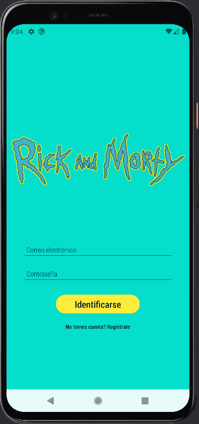
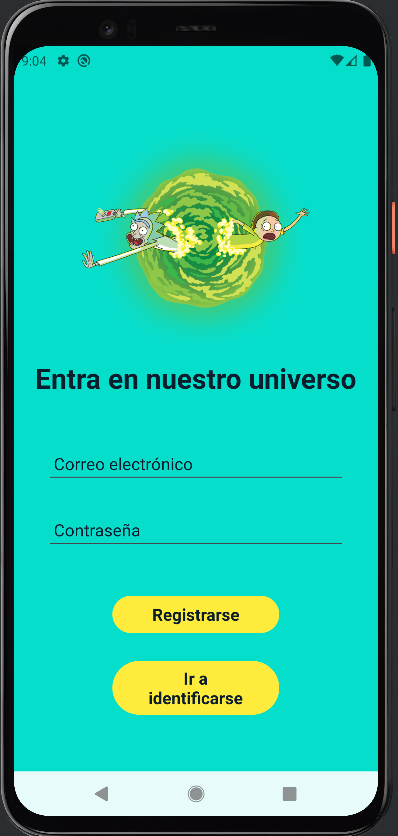
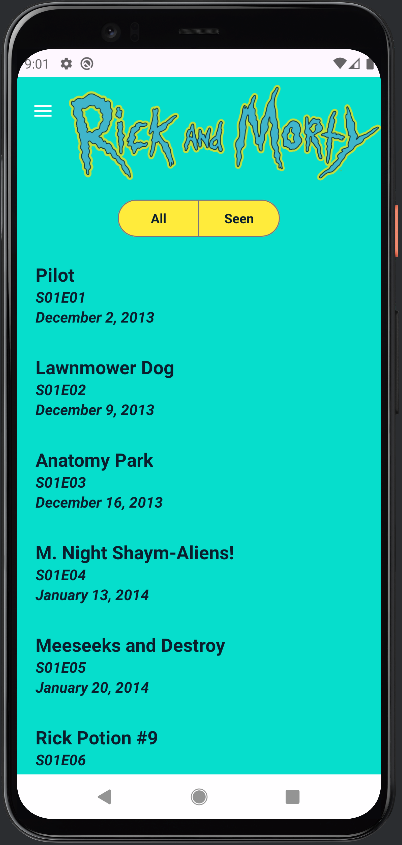
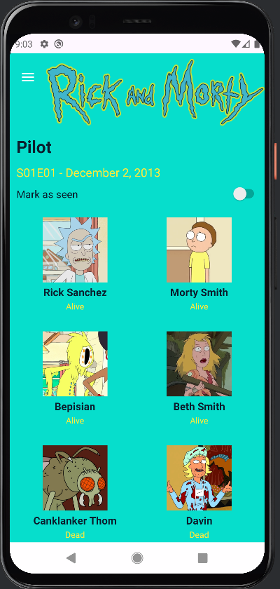
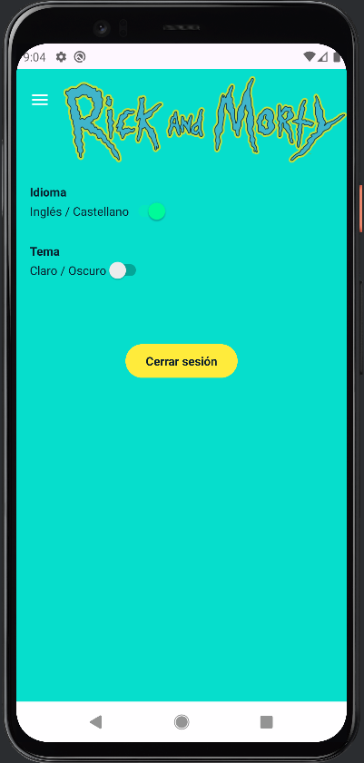
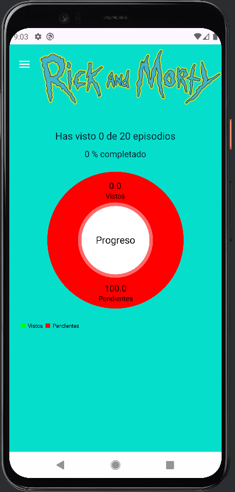

# Rick & Morty App

## Introducción
Rick & Morty App es una aplicación Android que permite explorar los episodios y personajes de la serie **Rick & Morty**.  
Su propósito es aprender a manejar **API REST**, **Firebase**, **Jetpack Components** y **Material Design**, creando una app con funcionalidades completas como autenticación, estadísticas y ajustes de usuario.

---

## Características principales

- **Autenticación con Firebase Auth**: Registro y login de usuarios.  
- **Listado de episodios**: Con nombre, código y fecha de emisión.  
- **Filtro de episodios**: Mostrar todos o solo los vistos.  
- **Marcado como visto**: Guardar si un episodio fue visto por el usuario.  
- **Detalle de episodio**: Mostrar personajes asociados, código y fecha.  
- **Estadísticas**: Porcentaje de episodios vistos con gráfico circular usando **MPAndroidChart**.  
- **Ajustes**: Cambio de tema (claro/oscuro) y cambio de idioma.  
- **Drawer Navigation**: Acceso rápido a episodios, estadísticas, ajustes y acerca de.  

---

## Tecnologías utilizadas

- **Lenguaje: Kotlin**  
  Kotlin es el lenguaje principal de la app.

- **Firebase: Authentication y Firestore**  
  Firebase Authentication se utiliza para registrar e iniciar sesión de usuario.  
  Firestore es la base de datos en la nube donde guardamos información como los episodios marcados como vistos o preferencias de usuario.

- **Retrofit2**  
  Retrofit facilita la comunicación con servidores web para obtener datos de la API de Rick y Morty, como la lista de episodios o los detalles de cada personaje.

- **Coil**  
  Coil permite cargar imágenes desde internet directamente en los ImageView de la app, como las fotos de los personajes, de forma rápida y eficiente.

- **RecyclerView**  
  RecyclerView se usa para mostrar listas dinámicas y scrollables, como la lista de episodios y los personajes de cada episodio, de manera optimizada.

- **SharedPreferences**  
  SharedPreferences guarda información simple en el dispositivo, como el tema oscuro o claro, el idioma seleccionado y los episodios vistos, para que la app recuerde estas preferencias.

- **Material Components**  
  Material Components incluye elementos visuales de diseño moderno como botones, Switches, ToggleGroups, Toolbar y Navigation Drawer, que hacen la app más atractiva y fácil de usar.

- **MPAndroidChart**  
  MPAndroidChart se utiliza para mostrar gráficas de progreso, como el porcentaje de episodios vistos, de forma visual y clara.

- **Jetpack Navigation**  
  La librería de navegación facilita moverse entre los diferentes fragmentos de la app, incluyendo el manejo del backstack y la integración con el Drawer.

- **ViewModel + LiveData**  
  ViewModel mantiene los datos de la app, y LiveData permite que la interfaz se actualice automáticamente cuando los datos cambian, haciendo la app más reactiva y estable.

---

## Instrucciones de uso

### Instrucciones para clonar el proyecto desde Android Studio (interfaz)

1. **Abrir Android Studio**  
   Al iniciar Android Studio, en la pantalla de bienvenida selecciona:  
   **Get from Version Control** (o en español, *Obtener desde control de versiones*).

2. **Seleccionar GitHub**  
   - En la ventana que aparece, en *Version control*, elige **Git** o **GitHub**.  
   - Si no has conectado tu cuenta de GitHub, haz clic en **Log in** e ingresa tus credenciales o token de GitHub.

3. **Pegar la URL del repositorio**  
   - En GitHub, abre tu repositorio y copia la URL HTTPS que aparece en *Code → HTTPS*.  
   - Pégala en Android Studio en el campo correspondiente.

4. **Elegir carpeta local**  
   - Selecciona la carpeta de tu computadora donde quieres guardar el proyecto.

5. **Clonar el proyecto**  
   - Haz clic en **Clone** (o *Clonar*).  
   - Android Studio descargará todos los archivos y abrirá automáticamente el proyecto.

6. **Sincronizar dependencias**  
   - Una vez abierto, Android Studio sincronizará los archivos `build.gradle` y descargará las librerías necesarias.

### Abrir el proyecto en Android Studio

1. **Seleccionar proyecto existente**  
   - En Android Studio, elige **Open an existing project** y busca la carpeta donde clonaste el repositorio.  
   - Espera a que Android Studio sincronice el proyecto y descargue las dependencias.

### Configurar Firebase

1. **Crear proyecto en Firebase Console**  
   - Ve a [Firebase Console](https://console.firebase.google.com/) y crea un nuevo proyecto.

2. **Registrar la aplicación Android**  
   - Añade una nueva aplicación Android y registra el nombre del paquete de tu app.  
   - Descarga el archivo `google-services.json` y colócalo en la carpeta `app/` de tu proyecto.

3. **Agregar plugin de Google Services**  
   - En el `build.gradle` de nivel app, añade si no está presente:  
     ```gradle
     apply plugin: 'com.google.gms.google-services'
     ```  
   - Sincroniza el proyecto para aplicar los cambios.

### Ejecutar la app

1. **Dispositivo o emulador**  
   - Conecta un dispositivo físico o utiliza un emulador de Android.

2. **Compilar y ejecutar**  
   - Haz clic en **Run** en Android Studio para compilar y ejecutar la aplicación.

### Iniciar sesión y usar la app

1. **Autenticación**  
   - Regístrate o inicia sesión con Firebase Auth.

2. **Explorar funcionalidades**  
   - Consulta la lista de episodios.  
   - Marca episodios como vistos.  
   - Consulta estadísticas.  
   - Ajusta preferencias en la sección de Ajustes.

---

## Conclusiones del desarrollador

Durante el desarrollo de esta aplicación, he aprendido mucho sobre cómo integrar diferentes componentes de Android y servicios externos como Firebase. La experiencia me permitió entender mejor la arquitectura de una app moderna y cómo los distintos elementos interactúan entre sí, desde la interfaz de usuario hasta la gestión de datos en la nube.

Uno de los aprendizajes más importantes ha sido trabajar con **Firebase Authentication y Firestore**. Configurar la autenticación y la base de datos me enseñó a manejar usuarios, permisos y almacenamiento en tiempo real, algo que antes me parecía abstracto. Aprendí también a organizar los datos de manera eficiente para que la app pueda mostrarlos sin retrasos y con una experiencia fluida para el usuario.

El uso de **Retrofit y la comunicación con APIs externas** fue otro reto interesante. Aprender a hacer peticiones, procesar respuestas JSON y mapear datos a modelos me permitió comprender mejor cómo interactuar con servicios externos de manera eficiente.

En cuanto a la interfaz, integrar **RecyclerView, Material Components y layouts** me permitió practicar cómo mostrar listas dinámicas y mantener la consistencia visual.

Finalmente, coordinar la **navegación entre fragments y la integración del Drawer con Navigation Components** también me causó algún problema que aprendí a resolver con los `popUpTo` y el manejo de `backstack`.

---

## Capturas de pantalla

### Pantalla de Login


### Pantalla de Registro


### Lista de Episodios


### Detalle de Episodio


### Ajustes de la App


### Estadísticas

